##  hyphi gym 

# Robustness Gymnasium Benchmark Suite

Gym-0.29 based compilation of benchmark environmens for various discrete action and observation spaces including different tasks.

## Holey Grid

To specifically assess the robustness to distributional shift, we offer the following static layouts:

HoleyGrid | HoleyGridShift
:--------:|:--------:|
 | 

Additionally, the following generated opions are supported:

HoleyGrid7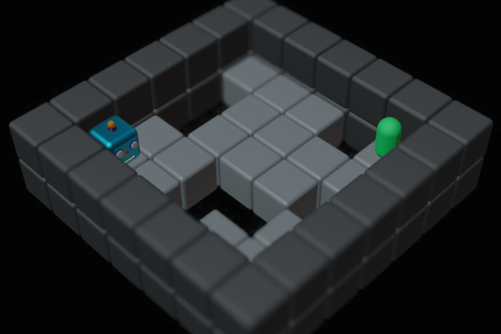 | HoleyGrid9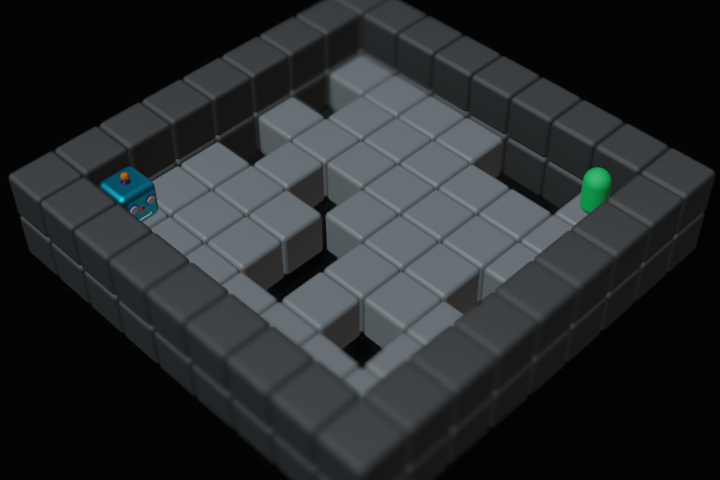 | HoleyGrid11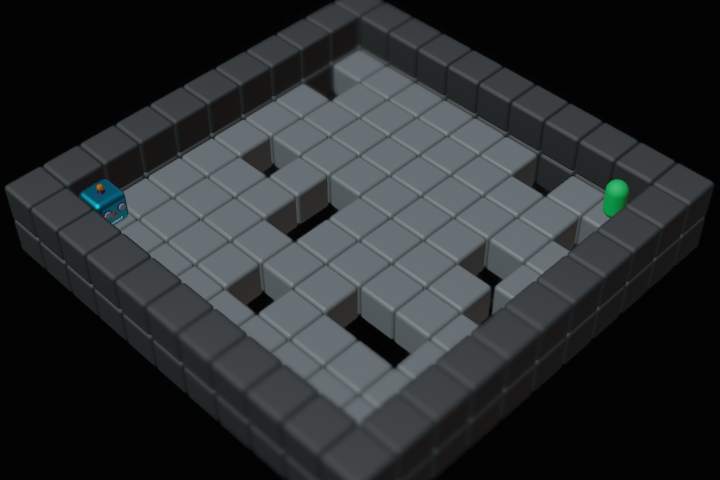 | HoleyGrid13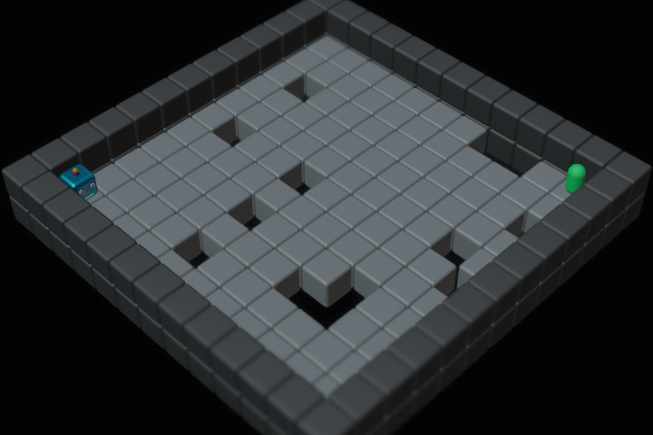 | HoleyGrid15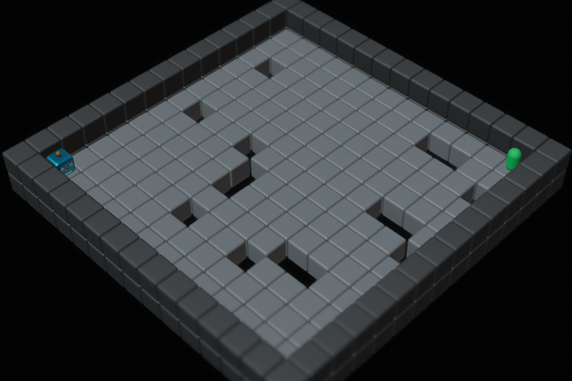
:-:|:-:|:--:|:--:|:--:|
HoleyGrids7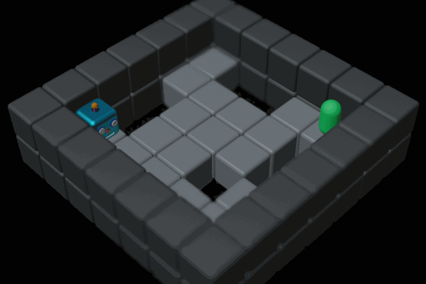 | HoleyGrids9 | HoleyGrids11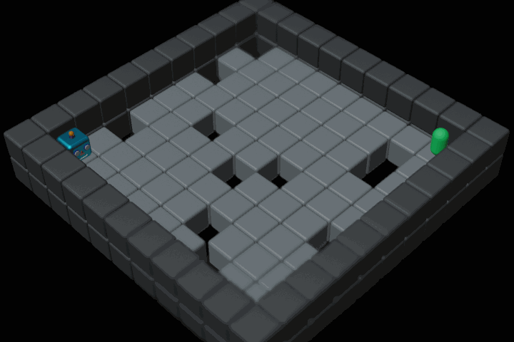 | HoleyGrids13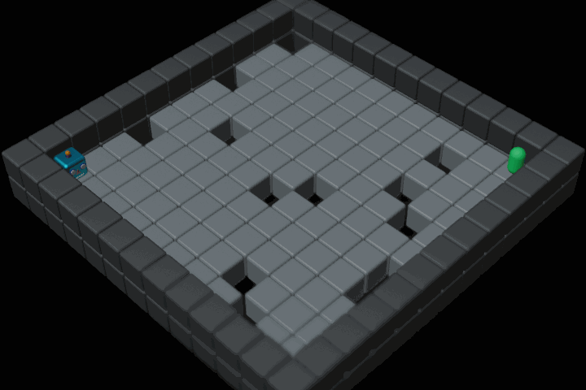 | HoleyGrids15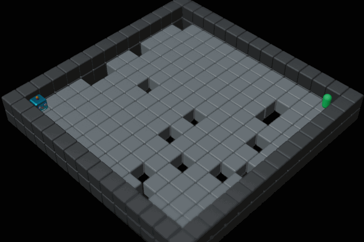

All generated layouts are ensured to have a valid solution path of lenght $n+m-6$ for $n \times m$ grids.

**Goal:** Navigate to the target state whilst avoiding unsafe states (holes). Episodes are terminated upon reaching the maximum of 100 steps, visiting an unsafe area, or reaching the target, yielding the termination reasons `TIME`, `FAIL`, and `GOAL` respectively.

**Action Space:** $\mathcal{A}\in\{Up,Right,Down,Left\}$

**Observation Space:** fully observable discrete observation of the $7\times9$ grid with all cells $\in \{A,F,G,H,W\}$ encoded as integers.

**Particularities:** This environment poses a safety challenge, where holes represent risk to be avoided.
Additionally, the polices' robustness to distributional shift can be assesed by evaluating either with a shifted goal, or shifted holes.

**Origin:** This environment is inspried by the AI Safety Gridworlds \[[Paper](https://arxiv.org/abs/1711.09883)\] \[[Code](https://github.com/deepmind/ai-safety-gridworlds)\].

## Holey Plane

HoleyPlane | HoleyPlaneShift | HoleyPlanes
:--------:|:--------:|:--------:|
 |  | 

**Goal:** Navigate to the target state whilst avoiding unsafe states (holes). Episodes are terminated upon reaching the maximum of 400 steps, visiting an unsafe area, or reaching the target, yielding the termination reasons `TIME`, `FAIL`, and `GOAL` respectively.

**Action Space:** 2-dimensional continuous action $\in [-1;1]$ applying force to the point in x- and y-direction.

**Observation Space:** 8-dimensional continuous observation containing the current position and velocity of the point as well as the distance vector to the target state and the closest hole.

**Particularities:** This environment yields simliar safety challenges as the HoleyGrid introduced above. Also, it alows for evaluation of robustness to distributional shifts.

**Origin:** This environment is inspried by the AI Safety Gridworlds \[[Paper](https://arxiv.org/abs/1711.09883)\] \[[Code](https://github.com/deepmind/ai-safety-gridworlds)\], and control from D4RL \[[Paper](https://arxiv.org/abs/2004.07219)\] \[[Code](https://github.com/Farama-Foundation/D4RL)\].

## GridMaze

Maze7 | Maze9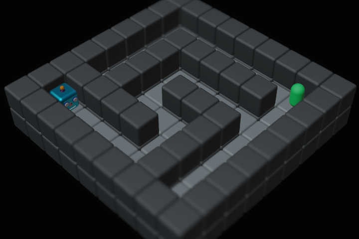 | Maze11 | Maze13 | Maze15
:-:|:-:|:--:|:--:|:--:|
Mazes7 | Mazes9 | Mazes11 | Mazes13 | Mazes15

**Goal:** Navigate the maze to reach the target within 100 steps (200 for Maze15).

**Action Space:** $\mathcal{A}\in\{Up,Right,Down,Left\}$

**Observation Space:** fully observable discrete observation of the variable-sized grid with all cells $\in \{A,F,G,W\}$ encoded as integers.  

**Reward structure:** Each step is rewarded $-1$ to foster the shortest path. Reaching the target terminates the episode and is rewarded $50$. All episodes are temrinated after 100 steps ressulting in two termination reasons: GOAL, TIME. The reward is either distributed in a dense fashion after every step, or sparse upon episode termination. Reward ranges are updated according to the current layout.

**Particularities:** This environment poses a generalization challenge, where a policy's robustness to changing layouts and positions can be evaluated in various scenarios. In a broader sense, different layouts may also be considered multiple tasks.

**Origin:** This environment is inspried by the Procgen Benchmark \[[Paper](https://arxiv.org/abs/1912.01588)\] \[[Code](https://github.com/openai/procgen)\]

## PointMaze

Maze7 | Maze9 | Maze11 | Maze13 | Maze15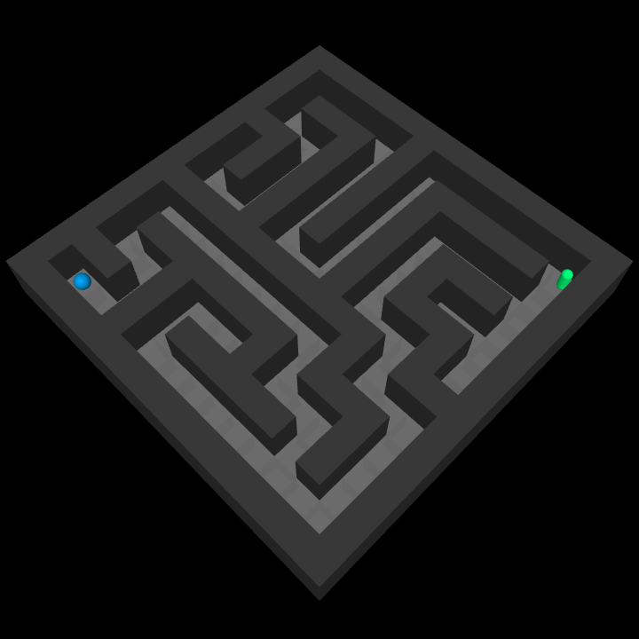
:-:|:-:|:--:|:--:|:--:|
Mazes7 | Mazes9 | Mazes11 | Mazes13 | Mazes15

**Goal:** Navigate the maze to reach the target within 200, 400, 600, 900, 1200 steps resprectively.

**Action Space:** 2-dimensional continuous action $\in [-1;1]$ applying force to the point in x- and y-direction.

**Observation Space:** 6-dimensional continuous observation containing the current position and velocity of the point as well as the distance vector to the target state.

**Particularities:** This environment yields simliar challenges as the GridMaze introduced above. However, in contrast, the agent does not observe the full state of the environment, but only a sparse representation of its own position and velocity.

**Origin:** This environment is inspried by the Procgen Benchmark \[[Paper](https://arxiv.org/abs/1912.01588)\] \[[Code](https://github.com/openai/procgen)\], and control from D4RL \[[Paper](https://arxiv.org/abs/2004.07219)\] \[[Code](https://github.com/Farama-Foundation/D4RL)\].

## Flat Grid

Base Grid Environment without obstacles and holes:

FlatGrid7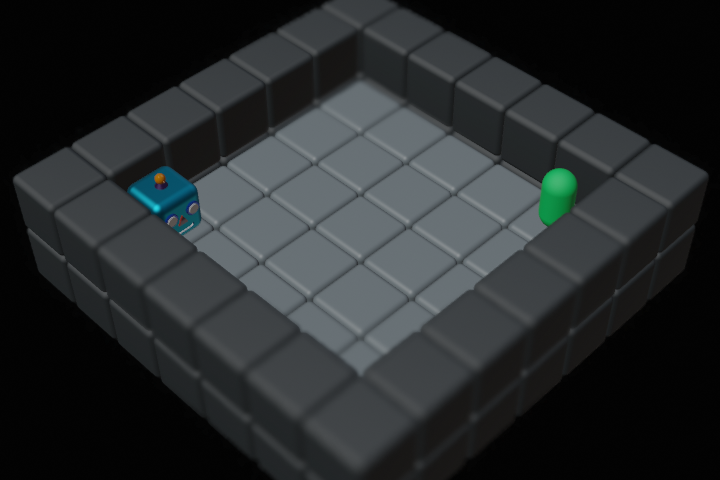 | FlatGrid9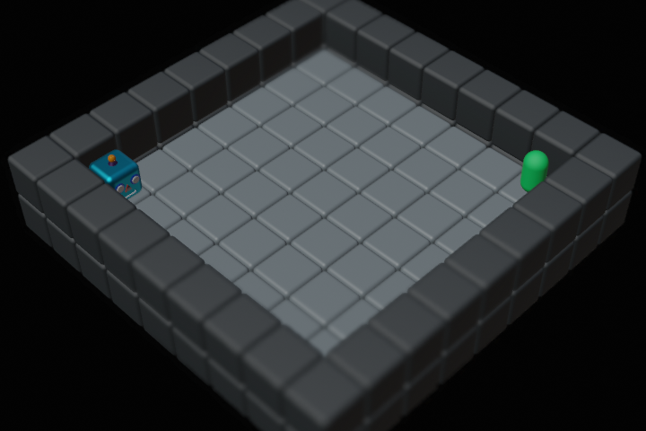 | FlatGrid11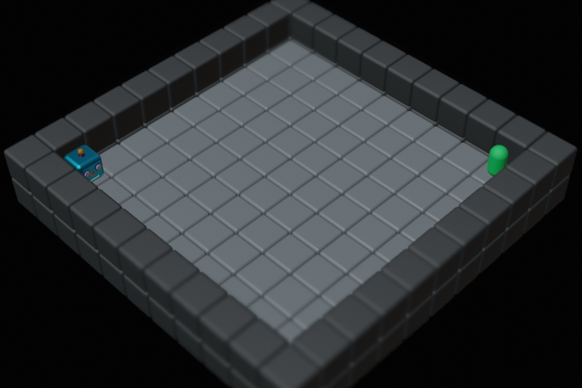 | FlatGrid13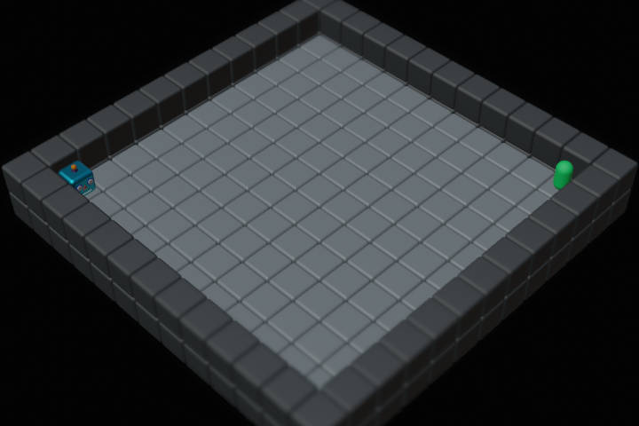 | FlatGrid15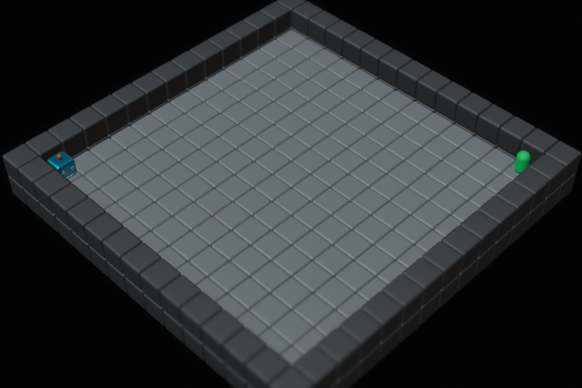
:-:|:-:|:--:|:--:|:--:|

**Goal:** Navigate the grid to reach the target within 100 steps.

**Action Space:** $\mathcal{A}\in\{Up,Right,Down,Left\}$

**Observation Space:** fully observable discrete observation of the variable-sized grid with all cells $\in \{A,F,G,W\}$ encoded as integers.  

**Reward structure:** Each step is rewarded $-1$ to foster the shortest path. Reaching the target terminates the episode and is rewarded $50$. All episodes are temrinated after 100 steps ressulting in two termination reasons: GOAL, TIME. The reward is either distributed in a dense fashion after every step, or sparse upon episode termination. Reward ranges are updated according to the current layout.

## Fetch

FetchReach | FechtSlide | FetchPlace
:---------:|:----------:|:----------:
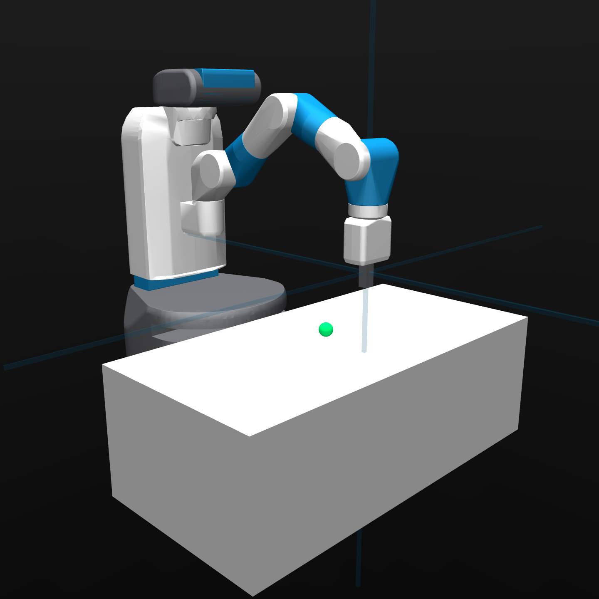 |  | FetchPlace

**Goal:** Control the  7-DoF [Fetch Mobile Manipulator](https://fetchrobotics.com) robot arm to reach the target by moving the gripper, sliding the object, or picking and placing the object within 100, 200 and 400 steps respectively.

**Action Space:** 4-dimensional continuous action $\in [-1;1]$ controlling the arm displacement in x-, y-, and z-direction as well as the gripper position. In its default configuration, the arm is not reset upon reaching a target and the target is randomly respawned.

**Observation Space:** 13-dimensional continuous observation containing the current position and velocity of the arm, the gripper as well as the position of the target state.

**Particularities:** In combination with the binary reward defined below, this environment yields a sparse exploration challenge. Furthmore it allows for benchmarking the multi-task performance of policies, with further tasks to be added in future versions.

**Origin:** This environment is inspried by the Metaworld Benchmark \[[Paper](https://arxiv.org/pdf/1910.10897.pdf)\] \[[Code](https://github.com/Farama-Foundation/Metaworld)\], based on [this paper](https://arxiv.org/abs/1802.09464), and the Gymnasium Robotics collection \[[Code](https://robotics.farama.org/envs/fetch/)\].

## Reward Structure

All tasks and environments use joint rewards comprising various objectives inherent with the intended task:
All reward shares as well as the final mixture can be adapted.

By default, the reward is comprised of the following discrete reward particles scaled by the maximum steps possible per episode (`max_steps`):

- Reach the target state (`GOAL = 0.5 * max_steps`)
- Avoid unsafe areas (`FAIL = -0.5 * max_steps`)
- Take as few steps as possible (`STEP = -1`)

To offer varying levels of challenging reward signals, we provide the following mixtures out of the box:

### Dense

By default the reward is defined as:
$$
r_t=
\begin{cases}
\mathtt{GOAL} & \quad \text{when } |A-T| \leq \Delta_T\\
\mathtt{FAIL} & \quad \text{when } |A-H| == 0\\
\mathtt{STEP} & \quad \text{otherwise}
\end{cases}
$$
where $|\cdot|$ denotes the distance of the agent $A$ to either the traget $T$ or an unsafe area $H$, and $\Delta_T$ denotes the threshold distance to the target state (especialy for the continuous environments).

### Sparse

Furthermore, all variations offer a sparse reward option, where the return is comunicated to the agent only upon episode termination:

$$
r_t=
\begin{cases}
\sum_{i=0}^t r_i & \quad \text{when t is terminal} \\
0 & \quad \text{otherwise}
\end{cases}
$$

This resembles a more realistic feedback situation and yields an even harder exploration challenge.

## Detailed

Furthermore, the following intermediate reward can be constantly supplied to the agent to reduce the challenge of exploration:

$$
r_t=e^{-\|agent-target\|_2}
$$

Defined by the L2 norm of the current absolute distance between the agent and the target, this detailed reward reflects movement towards the target.

## Random Variations

All environments comprise further random variations for both the agent's start- and the target-position.
In line with the maze naming convention, a singular keyword confirms to an initial random position, permagent over environment resets, where a plural keyword causes deterministic positioning on every reset.
Thus, the following variations may be used within the `random` list:

- ``Agent``: Initial position randomized once upon environment creation
- ``Target``: Target posision randomized once upon environment creation
- ``Agents``: Initial position randomized upon environment reset
- ``Targets``: Target posision randomized upon environment reset

HoleyGridAgent(s) | Maze9Agent(s) | HoleyGridTarget(s) |  Maze9Target(s)
:----------------:|:-------------:|:------------------:|:----------------:|
 |  |  | 

FetchAgent(s) | FetchTarget(s)
:------------:|:--------------:|
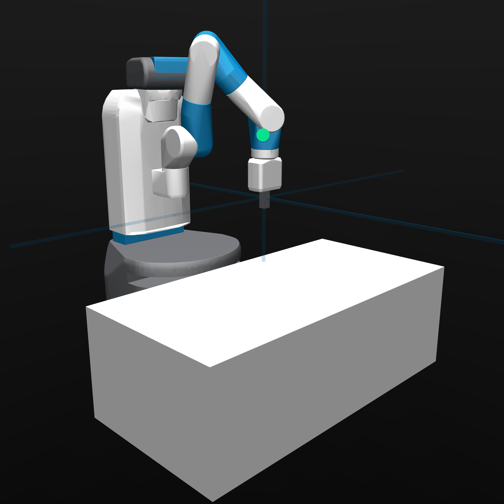 | 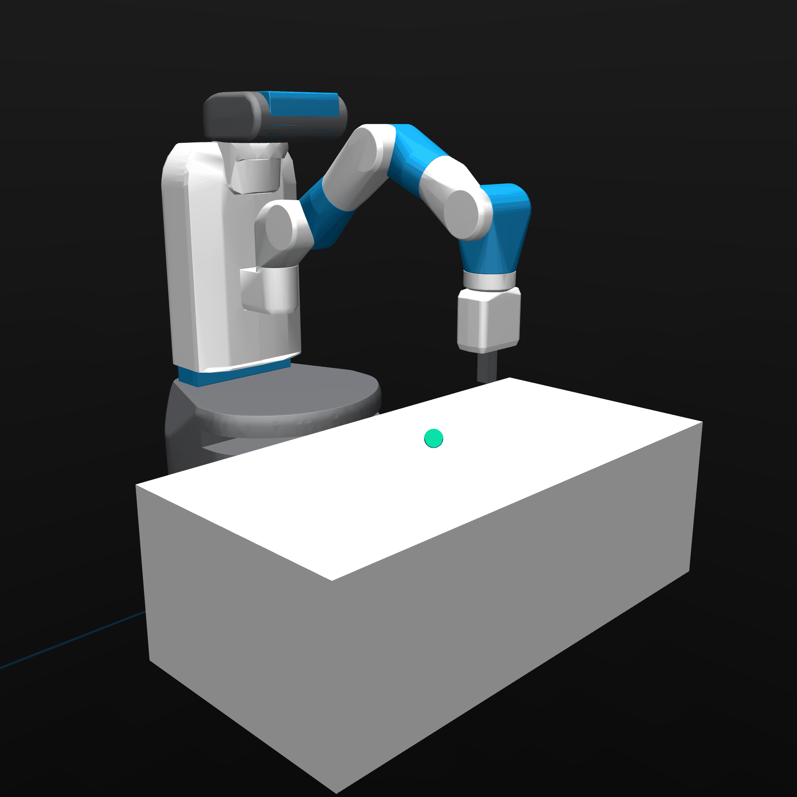

## Demo & Test

To test the environment, generate renderings of the layout, and demonstrate a trajectory, use the following script:

```sh
# python test [List of environment names] 
# (optional: --demo [trajectory])
python test PointMaze7 --demo 1 1 0 0 1 1 0 0 0 1
python test HoleyPlane --demo 2 1 0 1 1 0 1


# Generate Random Layout Grid Renderings
python test Mazes7 Mazes11 --runs 100 --grid
```

## Helpful Links

[XML-Reference](https://mujoco.readthedocs.io/en/stable/XMLreference.html#asset-mesh-refquat)
[3D Object Converter](https://github.com/kevinzakka/obj2mjcf)
