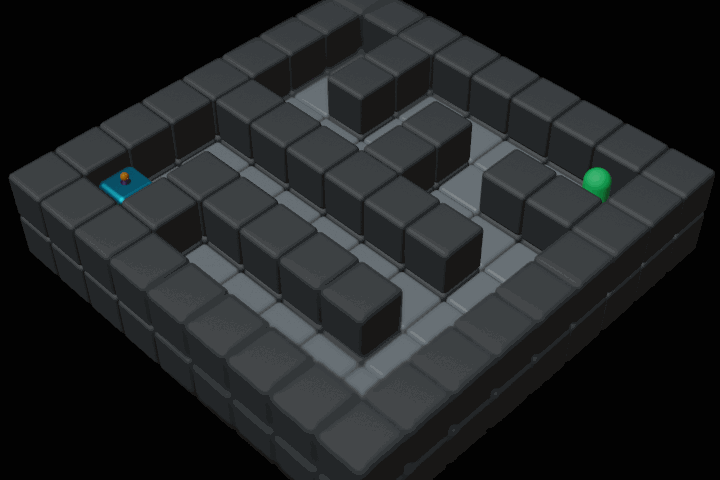

##  hyphi gym

# Robustness Gymnasium Benchmark Suite

Gym-0.29 based compilation of benchmark environmens for various discrete action and observation spaces including different tasks.

## Holey Grid

HoleyGrid | HoleyGridShift | HoleyGrids
:--------:|:--------:|:--------:|
 |  | 

**Goal:** Navigate to the target state whilst avoiding unsafe states (holes).

**Action Space:** $\mathcal{A}\in\{Up,Right,Down,Left\}$

**Observation Space:** fully observable discrete observation of the $7x9$ grid with all cells $\in \{A,F,G,H,W\}$ encoded as integers.

**Reward structure:** Each step is rewarded $-1$ to foster the shortest path. Reaching the target or falling into a hole both terminates the episode and is rewarded $50$ and $-50$ respectively. All episodes are temrinated after 100 steps ressulting in three termination reasons: GOAL, FAIL, TIME. The reward is either distributed in a dense fashion after every step, or sparse upon episode termination. Reward ranges are updated according to the current layout.

**Particularities:**
This environment poses a safety critical challenge, where holes represent risk to be avoided.
Additionally, the polices' robustness to distributional shift can be assesed by evaluatiing eihter with a shifted goal, or shifted holes.

**Origin:** This environment is inspried by the AI Safety Gridworlds \[[Paper](https://arxiv.org/abs/1711.09883)\] \[[Code](https://github.com/deepmind/ai-safety-gridworlds)\]

## Holey Plane

TODO: observe holes? -> lidar observation of walls, floor, hole, target?

## Grid Maze

Maze7 | Maze9 | Maze11 | Maze13 | Maze15
:-:|:-:|:--:|:--:|:--:|
Mazes7 | Mazes9 | Mazes11 | Mazes13 | Mazes15

**Goal:** Navigate the maze to reach the target.

**Action Space:** $\mathcal{A}\in\{Up,Right,Down,Left\}$

**Observation Space:** fully observable discrete observation of the variable-sized grid with all cells $\in \{A,F,G,W\}$ encoded as integers.  

**Reward structure:** Each step is rewarded $-1$ to foster the shortest path. Reaching the target terminates the episode and is rewarded $50$. All episodes are temrinated after 100 steps ressulting in two termination reasons: GOAL, TIME. The reward is either distributed in a dense fashion after every step, or sparse upon episode termination. Reward ranges are updated according to the current layout.

**Particularities:** This environment poses a generalization challenge, where a policy's robustness to changing layouts and positions can be evaluated in various scenarios. In a broader sense, different layouts may also be considered multiple tasks.

**Origin:** This environment is inspried by the Procgen Benchmark \[[Paper](https://arxiv.org/abs/1912.01588)\] \[[Code](https://github.com/openai/procgen)\]


## PointMaze

Maze7 | Maze9 | Maze11 | Maze13 | Maze15
:-:|:-:|:--:|:--:|:--:|
Mazes7 | Mazes9 | Mazes11 | Mazes13 | Mazes15

**Goal:** Navigate the maze to reach the target.

**Action Space:** 2-dimensional continuous action $\in [-1;1]$ applying force to the point in x- and y-direction.

**Observation Space:** 6-dimensional continuous observtion containing the current position and velocity of the point as well as the distance vector to the target state.

**Reward structure:** The reward is calculated by the L2 norm of the current absolute distance between the point and the target:
R=$e^{-\|point-target\|_2}****$

**Particularities:** This environment yields simliar challenges as the GridMaze introduced above. However, in contrast, the anent does not observe the full state of the envrionemnt, but only a sparse repreenation of its own position an velocity.

**Origin:** This environment is inspried by the Procgen Benchmark \[[Paper](https://arxiv.org/abs/1912.01588)\] \[[Code](https://github.com/openai/procgen)\]

https://github.com/Farama-Foundation/D4RL

https://arxiv.org/abs/2004.07219

Lookup for defining input xml:
https://mujoco.readthedocs.io/en/stable/XMLreference.html


Robotics tasks 

https://github.com/Farama-Foundation/Metaworld


## Random Variations

All environments comprise further random variations for both the agent's start- and the target-position.
In line with the maze naming convention, a singular keyword confirms to an initial random position, permanent over environment resets, where a plural keyword causes deterministic positioning on every reset.
Thus, the following variations may be used within the `random` list:

- ``Agent``: Initial position randomized once upon environment creation
- ``Target``: Target posision randomized once upon environment creation
- ``Agents``: Initial position randomized upon environment reset
- ``Targets``: Target posision randomized upon environment reset


HoleyGridAgent(s) | HoleyGridTarget(s) | Maze9Agent(s) | Maze9Target(s)
:----------------:|:----------------:|:----------------:|:----------------:|
 |  |  | 

### MuJoCo Helpers

[XML-Reference](https://mujoco.readthedocs.io/en/stable/XMLreference.html#asset-mesh-refquat)
[3D Object Converter](https://github.com/kevinzakka/obj2mjcf)
   

Additionals 

Heatmaps:

```py
from hyphi_gym.utils.plotting import heatmap
heatmap(env.iterate(fn),*args) 
```

## Demo / Test environemnts

To test the environment, generate renderings of the layout, and demonstrate a trajectory, use the following script:
**Example**

```sh
# python test [List of environment names] 
# (optional: --demo [trajectory])
python test PointMaze7 --demo 1 1 0 0 1 1 0 0 0 1
python test HoleyPlane --demo 2 1 0 1 1 0 1


# Generate Random Layout Grid Renderings
python test Mazes7 Mazes11 --runs 100 --grid
```

